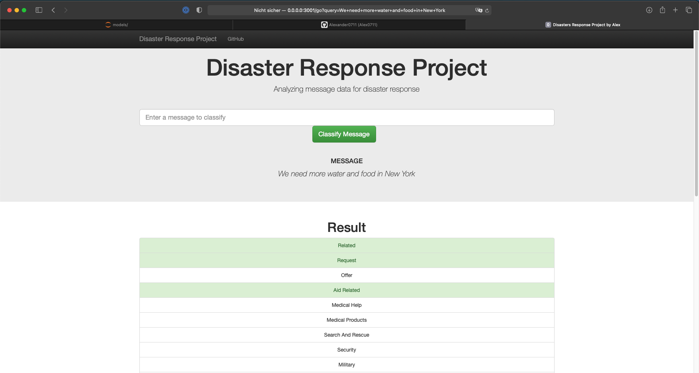
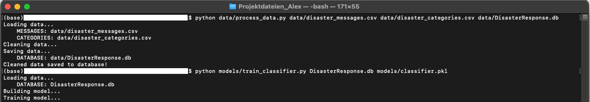
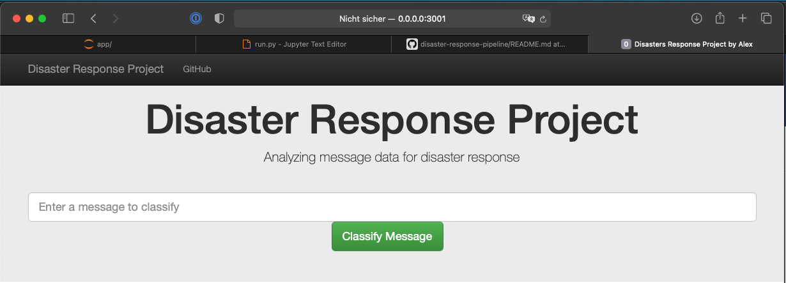
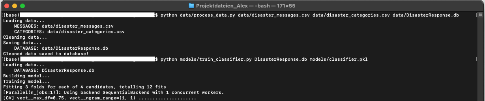
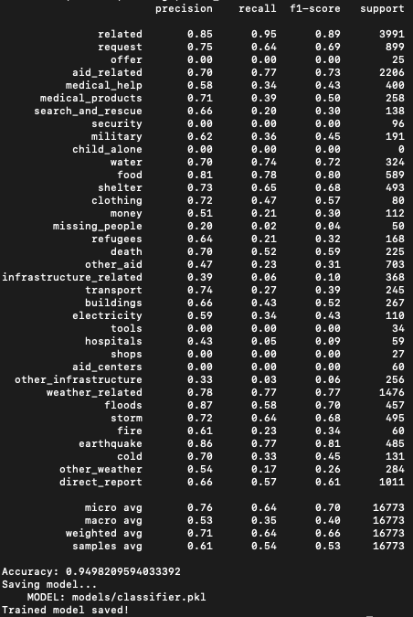

# Project: Disaster Response Pipeline

## Table of Content

- [Project Overview](#overview)
- [Project Software Stack](#stack)
  - [ETL Pipeline](#etl_pipeline)
  - [ML Pipeline](#ml_pipeline)
  - [Flask Web App](#flask)
- [Run the Project](#run)
  - [Data Cleaning](#cleaning)
  - [Training ML Classifier](#training)
  - [Run the Web App](#runapp)
- [File Structure](#files)
- [Software Requirements](#sw_requirements)
- [Conclusion](#conclusion)


<a id='overview'></a>

## 1. Project Overview

In the “Disaster Response Pipeline” project, I will apply data engineering and machine learning to analyze disaster data provided by <a href="https://www.figure-eight.com/" target="_blank">Figure Eight</a> and <a href="https://www.udacity.com/" target="_blank">Udacity</a> to build a ML classifier model that classifies disaster messages from social media and news.

The 'data' directory contains real messages that were sent during disaster events. I will create a machine learning pipeline to categorize these events so that appropriate disaster help agencies can be reached out for help.

In the project data 26248 messages with a unique id are included. Each massage will be categorized in the ML model within 36 categories.   

This project will include a web app where an emergency worker can input a new message and get classification results in several categories. The web app will also display visualizations of the data.


<a id='stack'></a>

## 2. Project Software Stack

The software stack of this project contains three main parts:

<a id='etl_pipeline'></a>

### 2.1. ETL Pipeline

File _/data/process_data.py_ contains data cleaning pipeline:

- Loads the 'disaster_messages' and 'disaster_categories' dataset
- Merges the two datasets in one
- Cleans the data in the combined data frame
- Stores the data in a **SQLite database “DisasterResponse.db”**

<a id='ml_pipeline'></a>

### 2.2. ML Pipeline

File _/models/train_classifier.py_ contains the machine learning pipeline:

- Loads data from the **SQLite database “DisasterResponse.db”**
- Splits the data into train and test data sets
- Builds a text processing and machine learning pipeline
- Trains and tunes a model using GridSearchCV
- Outputs analytics result on the test set
- Exports the final model as a pickle file

<a id='flask'></a>

### 2.3. Flask Web App

Running the start command (please see No.3) **from app directory** will start the web app. Users can enter their query, i.e., a request message sent during a natural disaster, e.g. _"We need more water and food in New York!"_.

**_Screenshot 1_**



What the app will do is that it will classify the new text message entered via the app. The app will classify the message into categories so that the relief agency can be reached out for help.

<a id='run'></a>

## 3. Run the Project

Starting with the ETL process there are three steps necessary to get the WebApp in place and use the tool.

**_Screenshot 2_**



<a id='cleaning'></a>

### 3.1. Data Cleaning

Run the following commands in the project's root directory to set up your database and model.

To run ETL pipeline that cleans data and stores in database:

```bat
python data/process_data.py data/disaster_messages.csv data/disaster_categories.csv data/DisasterResponse.db
```

The first two arguments are input data and the third argument is the SQLite Database in which we want to save the cleaned data. The ETL pipeline is in _process_data.py_.

_DisasterResponse.db_ already exists in _project's root directory_ folder but the above command will still run and replace the file with same information. 


<a id='training'></a>

### 3.2. Training ML Classifier

After the data cleaning process, run this command to run ML pipeline that trains classifier and saves ML classifier **from the project directory**:

```bat
python models/train_classifier.py data/DisasterResponse.db models/classifier.pkl
```

This will use cleaned data to train the ML model, improve the model with grid search and saved the model to a pickle file (_classifer.pkl_).

_classifier.pkl_ already exists but the above command will still run and replace the file will new information.


<a id='runapp'></a>

### 3.3. Run the Web App

After data cleaning and creation of the ML model the ML model will be used to predict new messages direct in the Web App interface.
Run the following command in the app's directory to run the web app.

**Go the app directory** and run the following command:

```bat
python run.py
```

This will start the web app.

Go to http://0.0.0.0:3001/

Here you can enter messages and get classification results for it.

**_Screenshot 3 "Frontend"_**




**_Screenshot 4 "Backend"_**




<a id='files'></a>

## 4. File Structure

<pre>
.
├── app
│   ├── run.py------------------------# FLASK FILE THAT RUNS APP
│   ├── templates
│       ├── go.html-------------------# CLASSIFICATION RESULT PAGE
│       └── master.html---------------# MAIN PAGE OF WEB APP
├── data
│   ├── 
│   ├── disaster_categories.csv-------# DATA TO PROCESS
│   ├── disaster_messages.csv---------# DATA TO PROCESS
│   └── process_data.py---------------# PERFORMS ETL PROCESS
├── images ---------------------------# PLOTS and SCREENSHOTS
├── models
│   └── classifier.pkl----------------# ML MODEL
│   └── train_classifier.py-----------# PERFORMS CLASSIFICATION TASK
├──DisasterResponse.db----------------# DATABASE TO SAVE CLEANED DATA
│
</pre>


<a id='sw_requirements'></a>

## 5. Software Requirements

The project uses **Python 3.7** and additional libraries: 
- _pandas_
- _numpy_ 
- _sys_
- _time_
- _collections_
- _json_
- _re_
- _warnings_
- _operator_
- _pickle_
- _pprint_
- _flask_
- _nltk_
- _plotly_
- _scikit-learn_
- _SQLAlchemy_

<a id='conclusion'></a>

## 6. Conclusion

Classification metrics for the ML model:

- Accuracy of the ML model is: 0.95 (accuracy is the fraction of samples predicted correctly)

- Recall of the ML model is: 0.64 (also known as sensitivity; is the fraction of positive events that were predicted correctly)

- f1-score of the ML model is: 0.70 (f1-score is the harmonic mean of recall and precision, higher score means a better model)

<a href="https://towardsdatascience.com/understanding-data-science-classification-metrics-in-scikit-learn-in-python-3bc336865019" target="_blank">Link to understanding Data Science Classification Metrics in Scikit-Learn in Python </a>

<a href="https://towardsdatascience.com/fine-tuning-a-classifier-in-scikit-learn-66e048c21e65" target="_blank">Link regarding Ffne tuning a classifier in scikit-learn </a>

You will see the exact value after the model is trained by grid searchdirect in the command line. 

Though the accuracy metric is high it has a poor value for recall. This ML model is not yet ready for production or the data input is not enough. 
But for this Show-Case the data and the ML model was great! 

**_Screenshot 5_**




